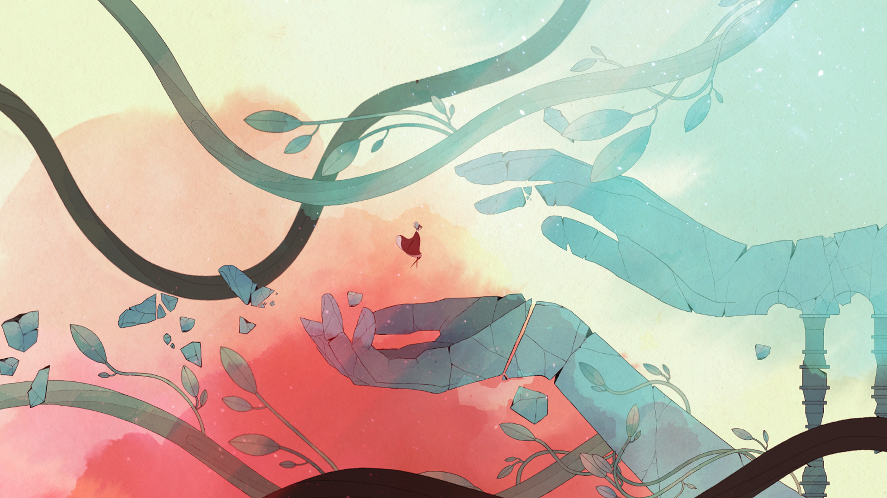
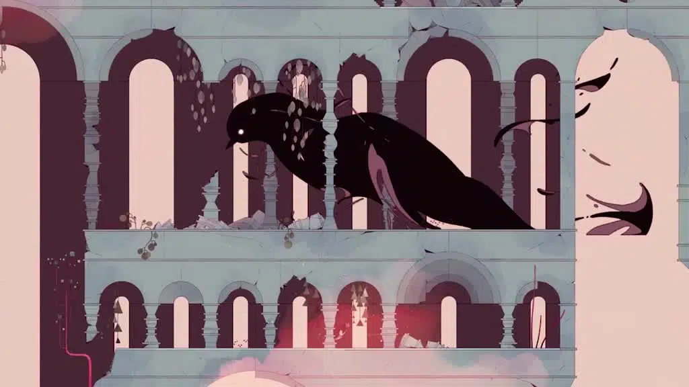

**TL;DR**: this videogame is a work of art on all levels. I experienced it as an emotional journey, and what follows is a kind of travel journal. I highly and enthusiastically recommend this game and am grateful to have experienced it.

---

This game had been on my list for a very long time, always nudged by other more or less prestigious titles. However, I felt the urge to use it as inspiration for a watercolor painting, where I could observe and experience every nuance of color, every detail of the ink: it resonated with me so much that I could not store it among other drawings, but displayed it next to my desk.
<figure>  
    
  <figcaption> My reference </figcaption>  
</figure>

After a rather turbulent experience with another video game, I was looking forward to experiencing Gris. My knowledge is limited to the fact that it is a platformer with particularly aesthetic graphics.

Lights off, I press New Game.
# Intro
I hear a song, then a cracked voice, and I immediately feel very empathetic. There's desolation now, outside and inside the character, and inside me. The lack of color reflects the lack of energy, even walking not quite easy. Usually in video games, I don't have much patience or empathy, especially in the first few minutes of the game, whereas here I'm already invested in the character, I understand her exhaustion, and I want to give her all the time she needs to take her first steps after such profound shattering.

I am so relieved when she starts moving normally. I can only hear the echo of her footsteps, which starts to alternate with the deafening noise of sudden gusts of red wind, obstructing the path we are already struggling on. Sometimes I find refuge in some places, but it is necessary to learn the art of solidity against the elements.

# Red
I notice that stones have small feet, moving and reacting to my presence, hiding. Birds take flight in flocks. I exist. The world does not hinder my passage, indeed it helps me, with wheels unfolding letting me cross areas for which my leap would not be enough. The elements of light I gather turn into constellations that become solid bridges to cross vast areas that I could not even imagine crossing. 

I climbed on the blades of a huge mill, I felt dizzy. This is not the first time I have had to overcome fear and jump.
# Green
Now I also have green. I have fallen deeper into a forest of square trees. I don't know whether to go left or right, and I'm afraid I'll miss something important if I make a choice, but if I keep exploring there's no turning back.

These trees are shape-shifters and have apples, which I can drop to delight a little square friend who begins to follow me. At first he is wary, hiding when I approach, but he doesn't just follow me, he imitates me like a child. I feel that I have a companion and a responsibility. He opens secret passages for me, then disappears. A short time later I find him again, and he lends me an element of light, no longer metaphorical.

Now the shape-shifting trees react to my jump. A number of square-crowned trees shift, and I find that jumping at the moment when there is no arrival platform is a powerful thrill, especially knowing that the jump itself has caused the initial platform to disappear and the arrival platform to appear.

My cloak not only provides warmth and solidity, but also allows me to glide. Those little birds I met help me to make firm and powerful jumps, capable even of crossing the massive stone. I am so happy to meet them, and I often free them from the jars in which they are trapped, and they allow me to explore, climb, and fly higher and higher, through the clouds.

I see two statues of women, one in despair, the other taking a hesitant step forward.

At the top, part of this flock turns into a huge bird, which I run away from and which seems to be very angry with me. The music suggests that it is my enemy. Its scream is as powerful and destabilizing as the red wind I have already faced, so I have to be solid in those moments to not be thrown away. I keep running, but always some of those little birds help me to jump. I realize that the scream of the bird I'm running from is only seemingly frightening: I can use it to glide.

<figure>  
    
  <figcaption> You no longer scare me.</figcaption>  
</figure>

It is a swallow, now flying with me. Only the ringing of a huge bell can finally push it away, and I am free to climb further. I see the welcoming hand and the eroded face of a woman.
# Blue
It rains.
I fell down again, into the forest, but this time there are huge water patches. When I am underwater, the sound is really realistic.
Now I have to trust not only the canopies of the shape-shifting trees, but also the watery canopies. My dear little birds are still around.
I was not expecting speleology in this game, but here I am in narrow, labyrinthine caves, where I can only hear the sound of my own footsteps.

I search again for elements of light, and in an ice cave a lightning flash freezes my state so I can collect the desired reward. Now I can swim and it is a wonderful feeling: I am swimming with tiny fish, but there is another element of light that I must hunt, and it takes me to another area. The deep sea, a black abyss beyond which I cannot descend. Four more elements of light to find, with nice puzzles, as they are not trivial, but also not to get stuck.

The constellation becomes a big glowing turtle that starts to swim with me and accompanies me into the depths. Now there is light and I am not alone. Her journey stops, but I continue to explore these caves with corals, animals, bioluminescent flowers.

I find the statue of the woman again, this time with her face intact. I am standing on her hand and she is looking at me; behind her is a huge full moon and a starry sky.
# Yellow
I sigh and the brief moment of peace is shattered by the swarm of black birds that envelops and destroys everything. The statue is shattered again and I am pursued by the swallow. It has changed shape, now it is a moray eel. I am terrified of moray eels and narrow underwater caves. 
Now I am running from a moray eel (then more moray eels) in a narrow underwater cave, completely in the dark. 

I think I've lost it, but it's all dark and I'm trying to escape this maze of caves by approaching the bioluminescent algae for some light. I don't know where I'm going, I'm just following the faint lights. There is silence and I am almost in total darkness, but I see an opening with more light on either side, I feel I have arrived in a safe place.

Instead I find the moray eel trying to eat me, with a sudden violent noise.
I don't think I've ever shaken so much in a game - I was very close to the screen because I couldn't see due to the darkness, it was quiet, and I wasn't thinking about the moray eel anymore. I was coughing and my heart was racing. I stood up and took a proper break.

The hunt is waiting for me, I continue to play.

For a moment I think I am faster than the iridescent-eyed moray eel, but I have to change my mind immediately: it is about to swallow me. I am almost ready to look away from the unpleasant scene, when something destroys it: it is the turtle, the same one that accompanied me to those depths. I get chills.

Soon I find myself in another dark cave. Come on, we've done so much to get out.
I open a new passage through an underground cave that leads me to a tree with watery canopies that I can climb back up. 

I encounter a glowing bird that lights my path, and allows me to see and travel roads I might not otherwise have seen. Entire architectures appear thanks to momentary bursts of light, and that's all I need to keep moving forward. 

I must find two elements of light. I find myself in inverted gravity, the world below above, but if it seems confusing at first, it becomes a very interesting and beautiful element of challenge.

I can sing now. I have shivers. My singing makes flowers and whole trees bloom. It opens new paths. I can even control some animals. At this point, I think my narrative cannot even remotely convey the beauty that I am experiencing, that I am immersed in. Think that all these passages and areas were right there when I was walking by a few minutes ago.
I am gathering more elements of light for a much larger constellation on a tree that I have burst into bloom. 

As I walk over it, the music is synchronized with my steps, one note per step.

I am about to climb the constellation, but the moray reappears and I look at it: it dissolves and my face appears. I fall into a dense black sea, which I try to ascent again, avoiding the fragments of statues and debris.

Everything is still desolate, gray, but I know these fragments well: I climb over them and end up on the hand. Now everything is rebuilt. I climb the constellation one last time, higher and higher, until I am completely bathed in light. 

End credits.
# General comments
I really appreciated the consistency of spaces, with the architecture always recognizable but never repetitive. For me, painting in watercolor and loving the effect of stain, to find an entire game in watercolor and even using watercolor stain as clouds was truly a dream.